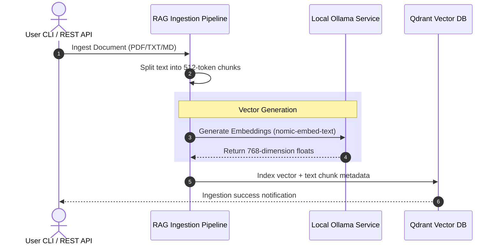

# Offline AI Stack: System Architecture

This document details the software design, container networking boundaries, and data flow of the private **Offline AI Stack**.

## 1. Network Topology & Boundaries

To guarantee complete privacy, all components run fully local. Containers run inside a private bridge network `offline-ai-net`, but they must communicate with Ollama and the FastAPI server which can run natively on the Windows host.

```
       ┌─────────────────────────────── HOST WINDOWS SYSTEM ──────────────────────────────┐
       │                                                                                   │
       │  ┌────────────────────────┐                   ┌────────────────────────────────┐  │
       │  │  Local Ollama Service  │                   │  Offline AI CLI & FastAPI App  │  │
       │  │      Port 11434        │                   │           Port 8000            │  │
       │  └───────────┬────────────┘                   └───────────────┬────────────────┘  │
       │              ▲                                                ▲                   │
       │==============║================================================║===================│
       │              ║              PRIVATE DOCKER BRIDGE BRIDGE      ║                   │
       │              ║                 (offline-ai-net)               ║                   │
       │              ▼                                                ▼                   │
       │  ┌───────────────────────┐   ┌───────────────────────────┐   ┌─────────────────┐  │
       │  │   OpenWebUI Container │   │      n8n Container        │   │ Qdrant Database │  │
       │  │      Port 3000        │   │        Port 5678          │   │    Port 6333    │  │
       │  └───────────┬───────────┘   └─────────────┬─────────────┘   └────────┬────────┘  │
       │              └─────────────────────────────┼──────────────────────────┘           │
       │                                            ▼                                      │
       │                             Shared Network Communications                         │
       └───────────────────────────────────────────────────────────────────────────────────┘
```

### Host-Gateway Networking (`host.docker.internal`)
* **Problem**: In standard Docker setups, containers cannot reference the host's `localhost` loops.
* **Solution**: We pass `extra_hosts={"host.docker.internal": "host-gateway"}` during container startup. When OpenWebUI or n8n need to connect to Ollama, they target `http://host.docker.internal:11434`.

---

## 2. Dynamic RAG Data Flow

The technical Ingestion and Query workflow flows as follows:



---

## 3. Storage Volumes & Mounting

All data generated by the offline stack is persisted directly to the workspace storage directory. This avoids container losses and makes database backups straightforward:

| Service | Mapped Host Path (Relative) | Internal Container Path | Purpose |
| :--- | :--- | :--- | :--- |
| **Qdrant DB** | `./data/qdrant` | `/qdrant/storage` | High-performance vector indexes |
| **OpenWebUI** | `./data/openwebui` | `/app/backend/data` | Chat logs, user accounts, UI parameters |
| **n8n Server** | `./data/n8n` | `/home/node/.n8n` | Automation workflows, credentials, tasks |
| **Ingest Store**| `./data/ingest` | *Native Host Path* | Local folder for bulk ingestion |

---

## 4. Language Adaptability & Optimizations

* **German-Language Optimization**: A custom instruction prompt can be dynamically appended during retrieval:
  `"Optimierung: Bitte antworte immer auf Deutsch..."`. The context is parsed natively by the embedding model, while the local LLM translates and structures the answer.
* **Multi-Model Support**: Standard configuration properties allow swapping the `LLM_MODEL` setting in `.env` to alternative local engines (e.g. `mistral`, `phi3`, `gemma`) instantly.
